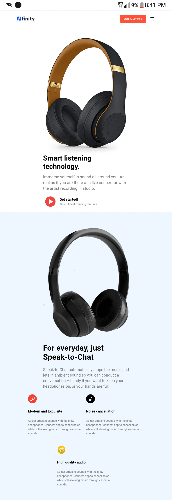
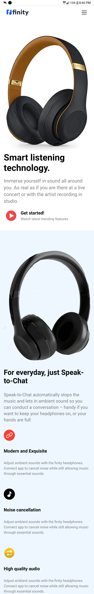

# infinity-headphones

landing page made with HTML and CSS.

## Table of contents

- [Overview](#overview)
  - [Screenshot](#screenshot)
  - [Links](#link)
- [My process](#my-process)
  - [Built with](#built-with)
  - [Continued development](#continued-development)
  - [Useful resources](#useful-resources)
- [Author](#author)

## Overview

### Screenshot

  - ##### Desktop Layout

  - ##### Mobile layout 

### Links

- Live Site URL: [ Live Site ](https://infinity-headphones.netlify.app/)

## My process

### Built with

- Semantic HTML5 markup
- CSS custom properties
- Flexbox
- Media Query
- Responsive web design 
- Desktop first workflow 

### Continued development

  - Learn and build projects with Tailwind CSS.
  

### Useful resources

-  [Flat Icon](https://www.flaticon.com) - This helped me add cool icons and images to the website.

## Author

- Website - [ Francis Jacob](https://github.com/Jacbfrancis)
- Twitter - [@jacobxavier_](https://twitter.com/jacobxavier_?t=YdJHQngdQYJVbC7mWspqDg&s=08)
